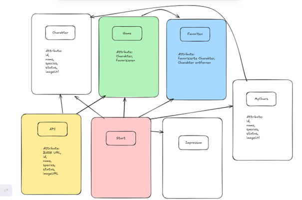
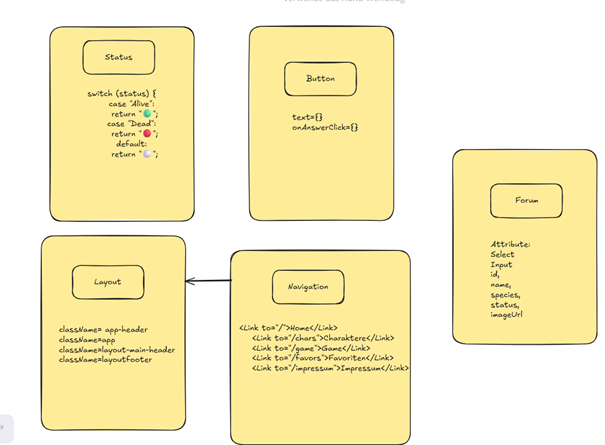
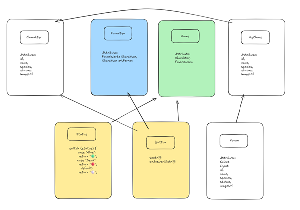
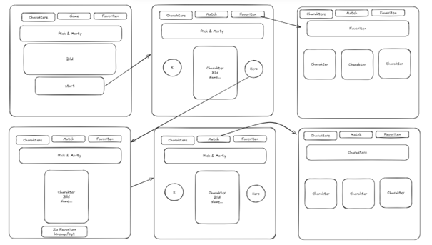
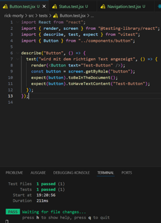
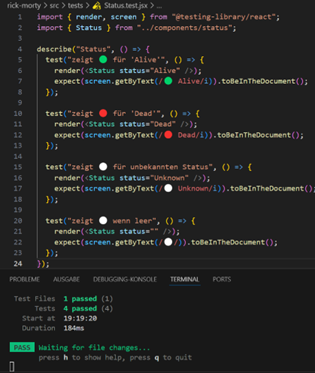
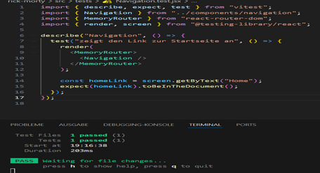

# React-Projektarbeit-Rick-Morty-Game-
Ein interaktives Charakter-Game mit Favoritenfunktion, inspiriert vom Rick &amp; Morty Universum

# Projektübersicht

Dieses React-Projekt ist eine interaktive Webapp, in welcher Fans der Kultserie «Rick & Morty» einen Überblick auf alle Charaktere der Serie haben, ein interaktives Spiel, um ihre Lieblingscharaktere auszuwählen und eine Auflistung ihrer Favoriten bietet. Ziel war es React-Komponenten, Routing, CRUD-Funktionalitäten und die Anbindung an externe APIs praxisnah anzuwenden.

---

## Anforderungskatalog

### Technologien & Tools:
• React: Für den Aufbau der Benutzeroberfläche mit wiederverwendbaren Komponenten  
• React Router: Für die Navigation und das Routing zwischen den Seiten (Home, Charaktere, Game, Favoriten, Impressum)  
• CSS: Für das Styling der Anwendung und der Navigation (Abstand, Fixierung, Buttons hervorheben)  
• Fetch API / REST API: Um Daten von der Rick & Morty API abzurufen und anzuzeigen  
• Git & GitHub: Versionskontrolle und Hosting des Projekts im Repository  
• Visual Studio Code: Entwicklungsumgebung für Coding, Testing und Git-Integration  
• Excalidraw: Für Storyboard und Scribble  

---

## User Stories:

### User Story 1:  
Als Benutzer der Rick & Morty App, will ich einen Überblick über alle Rick & Morty Charaktere haben, um zu sehen, ob sie noch am Leben sind.  
**Akzeptanzkriterien:**  
- Die Daten werden richtig von der Rick & Morty API geladen.  
- Jede Charakterkarte zeigt Name, Bild und Status (lebendig/tot/unbekannt).  
- Der Nutzer kann durch die Liste scrollen oder durch Seiten blättern.
  
**Definition of Done:**  
- Alle Akzeptanzkriterien wurden erfüllt.  
- Der Code wurde überprüft.  
- Die Funktion ist in der finalen Version enthalten.

---

### User Story 2:  
Als Fan der Serie Rick & Morty, will ich spielerisch meine Lieblingscharaktere als Favoriten speichern, damit ich sie schneller wiederfinde.  
**Akzeptanzkriterien:**  
- Unter dem Punkt Game kann man Charaktere als Favorit hinzufügen.  
- Ein Klick fügt den Charakter hinzu oder entfernt ihn.  
- Die Favoriten werden im local storage gespeichert.  
- Eine Seite nur mit zeigt alle favorisierten Charaktere an.
  
**Definition of Done:**  
- Alle Akzeptanzkriterien sind erfüllt  
- Der Code wurde überprüft.  
- Die Funktion ist in der finalen Version verfügbar

---

### User Story 3:  
Als Nutzer will ich, einfach zwischen den Seiten navigieren können, damit ich die App intuitiv nutzen kann.  
**Akzeptanzkriterien:**  
- Eine Navigationsgeräte oder ein Header ist auf allen Seiten zu sehen  
- Ein Klick auf Charaktere zeigt sie Seite mit den Charakteren  
- Ein Klick auf Game zeigt die Seite mit dem Spiel  
- Ein Klick auf Favoriten zeigt alle Favoriten
  
**Definition of Done:**  
- Alle Akzeptanzkriterien wurden erfüllt  
- Der Code wurde überprüft  
- Die Navigation ist in der finalen Version vorhanden

---

## Funktionale Kernaufgaben:
• Darstellung von Charakterdaten aus einer externen API  
• Navigation zwischen verschiedenen Screens (Routing)  
• CRUD-Funktionalität für Favoriten (Hinzufügen und Entfernen von Lieblingscharakteren)  
• Fehlerhandling und Validierung bei Benutzereingaben (z.B. bei Favoritenverwaltung)  
• Anzeige eines Impressums als statische Informationsseite

---

## Klassendiagramme:

### Klassendiagramm Pages:



### Klassendiagramm Komponenten:



### Klassendiagramm zusammen:




---

## Storyboard:

### StoryBoard:



---

## Screen Mockups:

### Screen Mockups:


---

## REST-API Schnittstelle:
In diesem Projekt wurde die REST-API von https://rickandmortyapi.com/ verwendet. Über HTTP-GET-Anfragen wurden die Daten zu Charakteren abgerufen.
Besonders verwendet wurden die Endpunkte /api/character (für die Liste) und /api/character/:id (für Details).
Die API liefert JSON-Objekte mit Eigenschaften wie Name, Status, Spezies, Geschlecht und Bild-URL, welche in der Anwendung angezeigt und verarbeitet werden.

### Verwendete Endpunkte:
| Methode | Endpunkt           | Beschreibung                              |
|---------|--------------------|-----------------------------------------|
| GET     | /api/character     | Gibt eine Liste aller Charaktere zurück |
| GET     | /api/character/:id | Gibt Detaildaten zu einem spezifischen Charakter |


### Beispiel JSON-Antwort:
```json
{
  "id": 1,
  "name": "Rick Sanchez",
  "status": "Alive",
  "species": "Human",
  "gender": "Male",
  "image": "https://rickandmortyapi.com/api/character/avatar/1.jpeg",
  "origin": {
    "name": "Earth (C-137)",
    "url": "https://rickandmortyapi.com/api/location/1"
  }
}
```

## Erklärung der Datenstruktur:
- id: Eindeutige ID des Charakters
- name: Name des Charakters
- status: Lebensstatus („Alive“, „Dead“, „Unknown“)
- species: Spezies des Charakters
- gender: Geschlecht
- image: Link zum Charakterbild
- origin.name: Ursprungsort des Charakters

---

# Testplan

| Testfall Nr | Beschreibung                           | Erwartetes Ergebnis                         | Kommentar                                           |
|-------------|-------------------------------------|--------------------------------------------|----------------------------------------------------|
| Test 1      | Button zeigt korrekten Text an      | Ein Button mit dem Text „Test-Button“ ist sichtbar | Überprüft, ob die Button-Komponente korrekt rendert |
| Test 2      | Status-Komponente zeigt 🟢 für „Alive“ | Es wird „🟢 Alive“ angezeigt                 | Prüft korrekte Emoji-Ausgabe für lebendige Charaktere |
| Test 3      | Status-Komponente zeigt 🔴 für „Dead“ | Es wird „🔴 Dead“ angezeigt                  | Prüft korrekte Emoji-Ausgabe für tote Charaktere     |
| Test 4      | Status-Komponente zeigt ⚪️ für unbekannten Status | Es wird „⚪️ Unknown“ angezeigt          | Stellt sicher, dass der Default-Fall funktioniert     |
| Test 5      | Navigation zeigt Link „Home“ korrekt an | Der Link mit Text „Home“ ist in der Navigation vorhanden | Einfache Komponententest, prüft das Vorhandensein eines Links |


## Testbeschreibung

1. **Button-Komponente**  
   - Testet, ob der Button mit dem übergebenen Text korrekt gerendert wird.  
   - Einfacher UI-Test für Wiederverwendbarkeit.

2-4. **Status-Komponente**  
   - Prüfen, ob für unterschiedliche Statuswerte („Alive“, „Dead“, sonst) das passende Emoji und der Text angezeigt werden.  
   - Beispiel: „🟢 Alive“, „🔴 Dead“, „⚪️ Unknown“  
   - Simpler Logik- und Rendering-Test.

5. **Navigation-Komponente**  
   - Testet, ob der Link „Home“ in der Navigation sichtbar ist.  
   - Nutzt React Router MemoryRouter für testfähige Umgebung.  
   - Einfacher Test für Navigationselemente.

---

## Durchführung des Testplans

1. **Vorbereitung der Testumgebung**  
   - Das Projekt wurde lokal auf dem Entwicklungsrechner mit Vite und React eingerichtet.  
   - Vitest als Test-Framework wurde installiert und konfiguriert (JSX-Unterstützung, jsdom Environment).  
   - Die nötigen Hilfsmittel wie React Testing Library wurden hinzugefügt, um Komponenten testen zu können.

2. **Erstellung der Testfälle**  
   - Basierend auf den Anforderungen wurden fünf Testfälle definiert (siehe Testplan).  
   - Testfälle decken einfache Komponententests (Button, Status, Navigation) ab.

3. **Schreiben und Ausführen der Tests**  
   - Für die Testfälle wurden 3 Test Files erstellt mit describe, test und passenden expect-Assertions erstellt.  
   - Die Tests wurden einzeln ausgeführt und mit npm test oder vitest kontrolliert.  
   - Fehler wurden analysiert und behoben (z.B. fehlende Setup-Dateien, JSX-Syntax in Tests).  
   - Bei erfolgreichen Testläufen wurde der nächste Testfall implementiert.

4. **Testwiederholung und Verifizierung**  
   - Nach Anpassungen an der Codebasis wurden Tests erneut ausgeführt, um Regressionen auszuschließen.  
   - Automatisierte Tests gewährleisten, dass Kernfunktionen stabil bleiben.

5. **Dokumentation der Testergebnisse**  
   - Testergebnisse wurden protokolliert, inklusive Status (bestanden/nicht bestanden).  
   - Screenshots oder Konsolenausgaben können bei Bedarf als Nachweis gespeichert werden.  
   - Die einfache Struktur der Tests ermöglicht schnelle Nachvollziehbarkeit der Testergebnisse.

---

## Dokumentation der Testfälle:

## Testfall 1:



## Testfall 2-4:



## Testfall 5:



